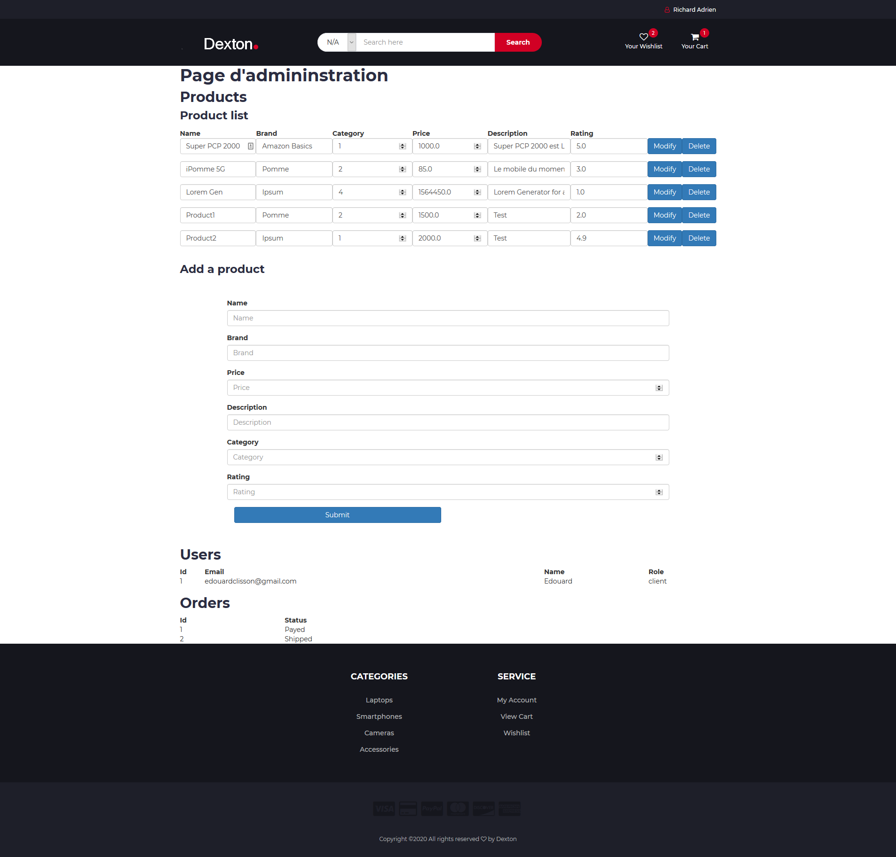
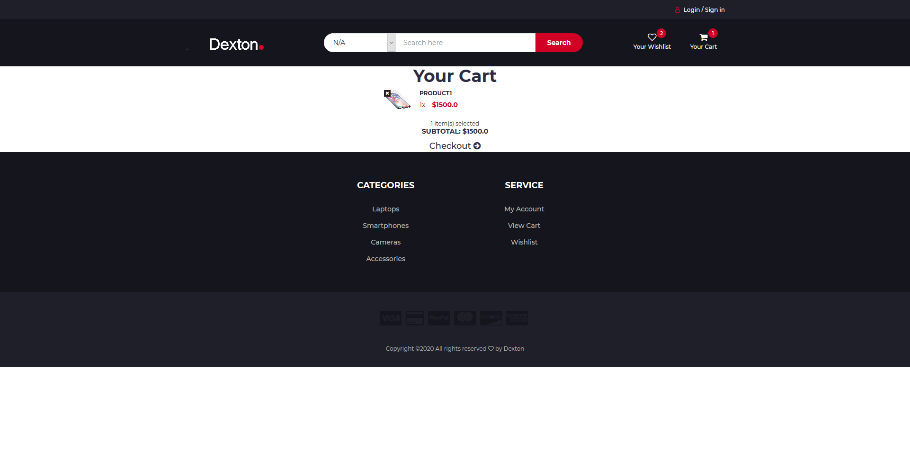
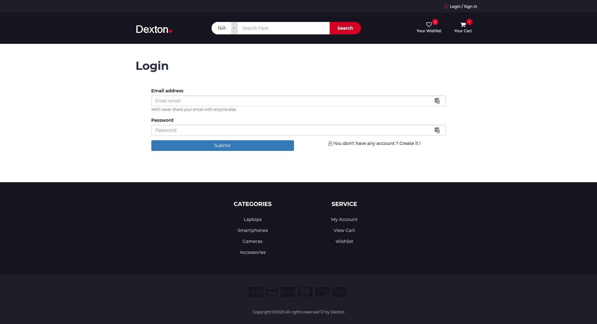
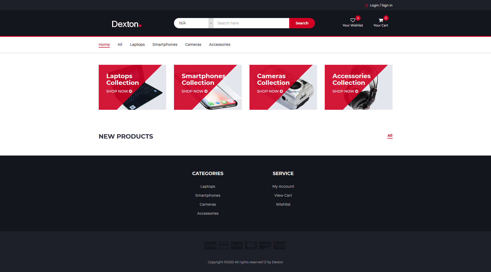
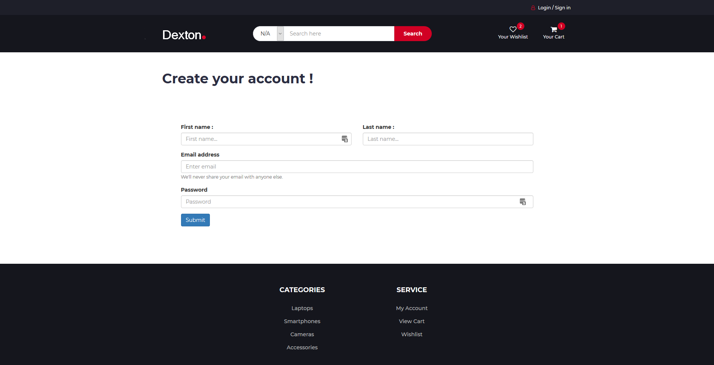
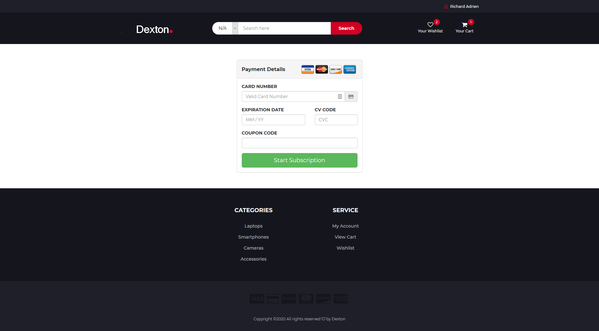
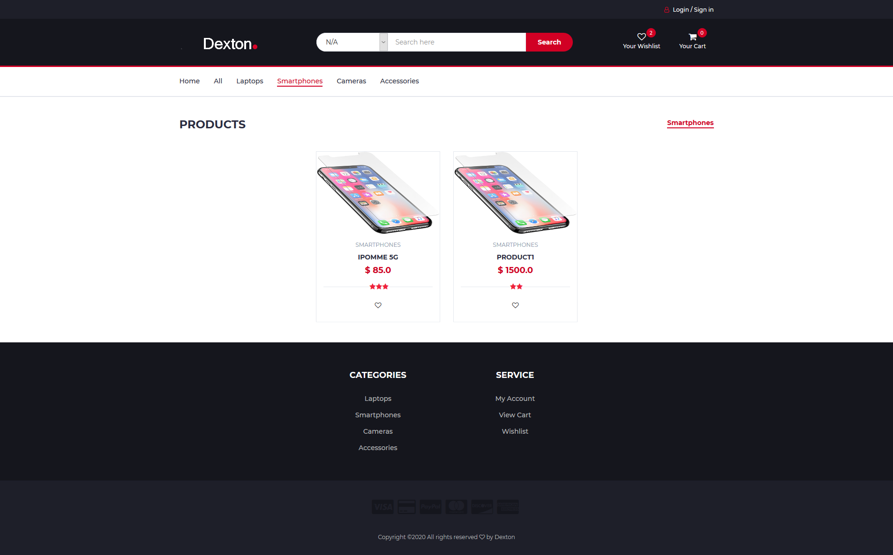
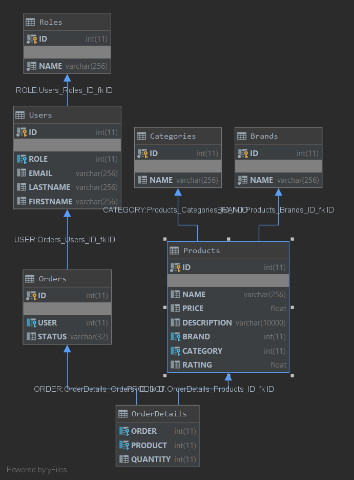

# Dexton, Java Web store

- [Dexton, Java Web store](#dexton-java-web-store)
  - [Configuration](#configuration)
  - [Administration](#administration)
  - [Documentation](#documentation)
    - [Repartition de taches](#repartition-de-taches)
    - [war file](#war-file)
    - [Database](#database)
    - [Pages](#pages)
      - [/Admin (Admin.java)](#admin-adminjava)
      - [/Cart (Cart.java)](#cart-cartjava)
      - [/Compte (Compte.java)](#compte-comptejava)
      - [/Connexion (Connexion.java)](#connexion-connexionjava)
      - [/Logout (Deconnexion.java)](#logout-deconnexionjava)
      - [/Home (Index.java)](#home-indexjava)
      - [/Inscription (Inscription.java)](#inscription-inscriptionjava)
      - [/Paiement (Paiement.java)](#paiement-paiementjava)
      - [/All, /Laptops, /Smartphones, /Cameras, /Accessories (Products.java)](#all-laptops-smartphones-cameras-accessories-productsjava)
  - [Database](#database-1)

## Configuration

Mettre en place la base avec les fichier sql dans docs/

To configure the project create a Config.java based on the ConfigSample.Java.

## Administration

if you are an Admininstrator you can accest the /Admin route.

## Documentation

Dexton est un site de vente en ligne d'objets high tech.

**La bar de recherche est fonctionelle**

### Repartition de taches

Frontend :
Lou B.
Marc-Antoine P.

Backend
Adrien R.
Edouard C.

### war file

Le .war exporter est dans export/. Il a été exporté avec Intelliji.

### Database

Elle est constiter de plusieur tables :

- Table des objets
- Table des users
- Table des roles
- Table des commandes

### Pages

#### /Admin (Admin.java)

Page d'administration uniquement accesible par les admininstrateurs.
Seul les administrateur peuvent ajouté des objets ou les modifier des objets.

#### /Cart (Cart.java)

Page de visualisation se con panier

#### /Compte (Compte.java)

Page pour voir son compte

#### /Connexion (Connexion.java)

Page pour ce connecter

#### /Logout (Deconnexion.java)

Permet de se Deconecter
(vas de visuel pour cette page)

#### /Home (Index.java)

Page d'acceeuil de l'application

#### /Inscription (Inscription.java)

Page de creation de compte

#### /Paiement (Paiement.java)

Page de payement, ici on fait seulement une simulation du payement

#### /All, /Laptops, /Smartphones, /Cameras, /Accessories (Products.java)

Page d'acces au different produits en fonction de leur categories

## Database

